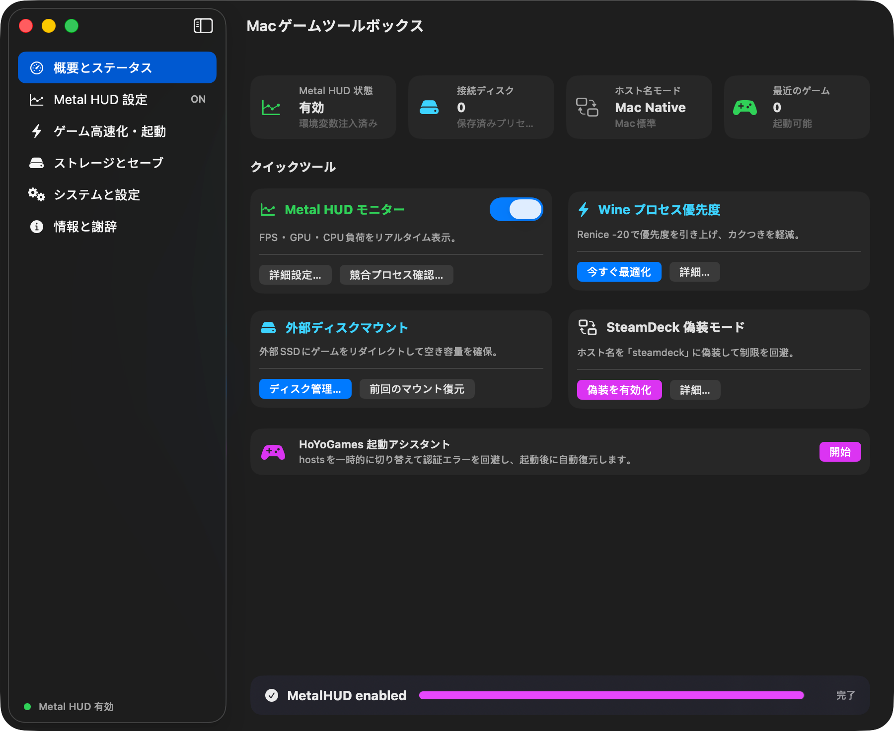
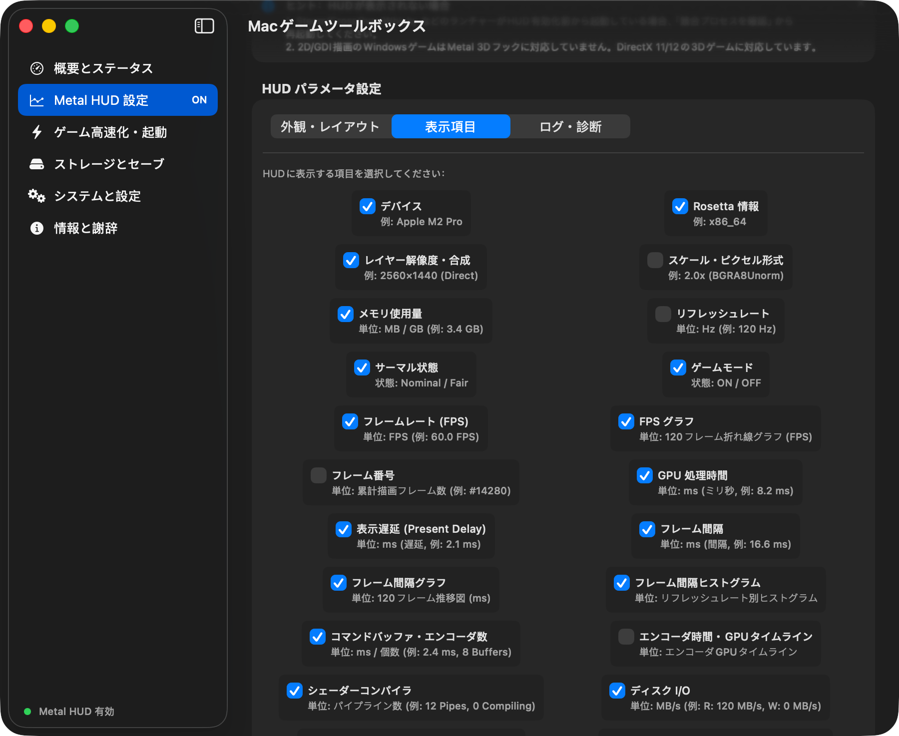

# Mac ゲーミングツールボックス (Mac Gaming Toolbox) - 拡張フォーク版

[简体中文](README.md) | [English](README_EN.md) | [日本語](README_JA.md)

[](LICENSE)
[](https://apple.com/macos)
[-brightgreen.svg)](https://apple.com/mac)
[](https://github.com/Souitou-iop/mac-gaming-toolbox/releases)

> **本リポジトリについて**：本プロジェクトは、原作者 **[@我是艾文喵 (Iven)](https://github.com/aiwentongxue)** 氏によるオープンソースプロジェクト [aiwentongxue/mac-gaming-toolbox](https://github.com/aiwentongxue/mac-gaming-toolbox) をベースに、UIの完全刷新・機能拡張・安定性向上を行ったフォーク版（Fork）です。

---

## 💖 原作者への謝辞 (Credits & Acknowledgements)

本プロジェクトの基盤を築き、Apple Silicon 上でのゲームプレイ環境や Wine / GPTK 最適化の道を切り拓かれた原作者 **我是艾文喵 (Iven)** 氏に心より感謝と敬意を表します。

- **元リポジトリ (Upstream)**：[aiwentongxue/mac-gaming-toolbox](https://github.com/aiwentongxue/mac-gaming-toolbox)
- **作者 Bilibili チャンネル**：[我是艾文喵 (Bilibili)](https://b23.tv/dV7YBJQ)
- **作者 YouTube チャンネル**：[我是艾文喵 (YouTube)](https://youtube.com/channel/UC0TgypOLHt2fXboVw34SKVQ)
- **公式解説動画**：[Bilibili リリース動画](https://b23.tv/qnJBcbk) · [YouTube 動画ガイド](https://youtu.be/Y9g4F0_6ipI?si=i3G9dxiXMbk2NSzY)

---

## 🖼️ スクリーンショット (Screenshots)

<p align="center">
  
  
</p>

---

## 🚀 本フォーク版の強化・拡張機能 (Fork Enhancements)

本フォーク版では、元の利便性をそのままに、macOS ネイティブの操作性、超解像スケーリング、ゼロ遅延動的補フレーム、詳細な Metal パフォーマンス測定、セーブデータ保全、多言語対応などを大幅に強化しています：

### 1. ⚡ 超解像スケーリングとゼロ遅延動的補フレーム (MetalGoose & MetalDuck 統合)
- **ゼロ遅延ハードウェア運動外挿 (2x / 3x / 4x 補正)**：Apple Silicon の Media Engine と Metal Compute Shader を活用し、入力遅延を追加することなく（0 ms 追加遅延）フレームレートを 2倍・3倍・4倍に向上。
- **MetalFX 空間超解像 (Spatial Upscaling)**：33%、50%、67%、75% のレンダリング解像度から高精細な Retina/4K 表示へアップスケールし、重量級ゲームの GPU 負荷を大幅に削減。
- **CAS 鮮鋭化 & SMAA アンチエイリアス**：コントラスト適応型鮮鋭化（CAS）と 3-pass SMAA / FXAA 形態学的アンチエイリアスにより、ボケやジャギーを徹底的に除去。
- **適応型 6-Sigma シーンチェンジ保護**：64x64 輝度グリッドと動的 EMA アルゴリズムにより、カメラの瞬間切り替え時のモーフィングや画面の歪みを完全に抑止。
- **グローバルショートカット & 合成ハードウェアカーソル**：`⌘⇧T` でいつでも補正オン/オフ、`⌘⇧C` でマウス拘束切り替え、高リフレッシュレート対応の合成カーソル描画に対応。

### 2. 🎨 macOS ネイティブサイドバー UI への刷新
- 従来の階層モーダルやダイアログを撤廃し、Apple HIG に完全準拠した `NavigationSplitView` サイドバー構成に刷新。
- 標準 `GroupBox` コントロールを採用し、システムの外観（ダーク/ライトモード）に自然に馴染む洗练されたデザイン。

### 3. 📊 Metal HUD 詳細パラメータ調有 & 23項目の表示指標
- **外観の自由調整**：10%〜100% のスケールスライダー、0〜100% の不透明度、画面四隅（右上/左上/右下/左下）の配置に対応。
- **23項目の表示指標**：FPS、GPU処理時間、表示遅延、レイヤースケール、シェーダーコンパイル状況など、各項目に**単位・数値例**を明記。
- **高度なトレーシング**：HUD デバッグログ、シェーダーコンパイルログ、GPU エンコーダタイムラインの記録に対応。

### 3. 🎯 アプリ別個別 HUD プロファイル
- ゲームごとに専用の HUD 設定を紐付け可能（例：対戦ゲームはFPSのみの最小表示、重量級RPGはGPU・シェーダーの詳細表示）。
- 最近のゲーム一覧から右クリックで簡単にプロファイル保存・呼び出し可能。

### 4. 📝 ワンクリック性能診断スナップショット出力
- macOS バージョン、Apple Silicon チップ仕様、HUD 設定、Wine プロセス状態を自動収集。
- Markdown 形式（`.md`）の構造化レポートを出力し、Discord、Reddit、GitHub などでの情報共有を円滑化。

### 5. 🔍 競合プロセス診断と安全な再起動
- HUD 有効化前に起動していた Steam、CrossOver、Whisky、Wine バックグラウンドプロセスを自動検出。
- チェックボックスで選択したプロセスを一括で安全に再起動し、「HUD がゲーム内に表示されない」問題を解決。

### 6. 💾 Windows ゲームセーブデータ検出 & Zip バックアップ
- CrossOver、Whisky、Heroic、Wine コンテナ内の深いセーブデータ階層（`AppData/Local`、`Saved Games`、`My Games` 等）を自動検出。
- ワンクリックで Finder 表示、または標準の `.zip` 形式で一括バックアップ。コンテナ再作成時のデータ消失を防ぎます。

### 7. ☕ Caffeinate ネイティブゲーム集中モード
- システム標準の `caffeinate` デーモンを実行し、ゲーム中やシェーダーコンパイル時の画面消灯・スリープ・省電力スロットリングを徹底防止。
- フルスクリーン起動による macOS ゲームモード（コントローラー・AirPods の Bluetooth サンプリングレート倍増）を案内。

### 8. 🛡️ パスワード不要の安全な起動診断と残存ファイルクリーンアップ
- **起動時パスワード要求ゼロ**：起動時は完全読み取り専用の被動診断のみを行い、**管理者のパスワード入力を要求しません**。
- **過去バージョンの残存ファイル削除**：過去の旧バージョンで残された Helper ファイルを検出・一括クリーンアップ。
- **アプリアイコン正常表示**：特権サービスを `macgametoolbox.helper` に整理し、システム設定「ログイン項目」でアイコンを正常表示。

### 9. 🌐 3言語リアルタイム切替 (日本語 / 英語 / 簡体中文)
- **日本語 (ja)**、**English (en)**、**简体中文 (zh-Hans)** を完全サポート。
- システム言語への自動追従に加え、設定画面からリアルタイムに言語を切り替え可能。

### 10. ⚡ Apple Silicon ARM64 専用ビルド & 単一 Zip 配布
- x86_64 の冗長コードを排除し、Apple Silicon (M1/M2/M3/M4) 専用の高速・軽量ネイティブビルド。
- 単一の純粋な `.zip` 形式で配布し、解凍してアプリケーションフォルダに入れるだけで即座に利用可能。

---

## 📋 機能比較表 (Comparison)

| 機能 / 特徴 | 元のバージョン (Upstream) | 本フォーク強化版 (v4.0.9) |
| :--- | :---: | :---: |
| **超解像・動的補フレーム** | なし | **ゼロ遅延ハードウェア外挿 (2x-4x)、MetalFX超解像、CAS、TAA/SMAA/FXAA** |
| **UI アーキテクチャ** | 従来のフローティングウィンドウ / モーダル | 現代的なネイティブサイドバー (`NavigationSplitView`) |
| **起動時の動作** | 起動時に管理者パスワードを要求する場合あり | **完全パスワード不要の被動診断（特権時のみ認証）** |
| **Metal HUD 調整** | 全体オン/オフ・簡易起動 | **10-100%スケール、不透明度、四隅配置、23項目（単位例付き）** |
| **アプリ別設定** | 単一アプリの起動のみ | **ゲーム個別の専用 HUD プロファイル保存・適用** |
| **性能レポート出力** | 通常のテキストログ出力 | **Markdown 形式の性能診断スナップショット出力** |
| **競合プロセス診断** | なし | **常駐ランチャー・Wine プロセスの自動検出と安全な再起動** |
| **セーブデータ管理** | なし | **AppData/SavedGames の自動スキャン・Finder表示・Zip保存** |
| **スリープ・性能抑制防止** | なし | **Caffeinate ゲーム集中モード（スリープ・消灯・降頻防止）** |
| **多言語対応** | 中国語 / 簡易英語 | **日本語 / English / 简体中文（リアルタイム切替対応）** |
| **ビルドと配布形式** | ユニバーサルバイナリ | **Apple Silicon ARM64 専用ネイティブビルド、軽量単一 Zip** |

---

## 💻 動作環境

- **OS**：macOS 14.0 (Sonoma) 以降
- **アーキテクチャ**：Apple Silicon (M1 / M2 / M3 / M4 シリーズ)
- **ビルド環境**：Xcode 16+, Swift 6, Command Line Tools

---

## 📦 ソースコードからのビルド

```bash
# 1. リポジトリをクローン
git clone https://github.com/Souitou-iop/mac-gaming-toolbox.git
cd mac-gaming-toolbox

# 2. リリースビルドと Zip パッケージングの実行 (ARM64 のみ)
ARCHS=arm64 ./Scripts/build-release.sh && ./Scripts/package-zip.sh "build/DerivedData/Build/Products/Release/Mac 游戏工具箱.app" "build/Mac 游戏工具箱-arm64.zip"
```

ビルド完了後、単一のインストール用 Zip ファイルが `build/Mac 游戏工具箱-arm64.zip` に生成されます。

---

## 📄 ライセンス

本プロジェクトは **GNU General Public License v3.0 (GPL-3.0)** の下で公開されています。詳細は [LICENSE](LICENSE) をご覧ください。
